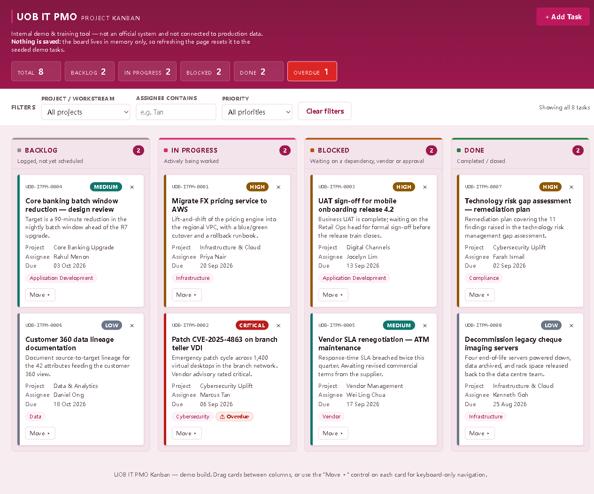

# UOB IT PMO — Project Kanban

A single-file Kanban board for tracking IT project management office work across
four columns: **Backlog → In Progress → Blocked → Done**. It is one `index.html`
with no build step, no framework and no dependencies — open the file and it runs.

**Live: https://super211.github.io/newrepo/**



## What it does

- Cards carry a title, description, project, category, assignee, priority, due
  date and status; overdue cards (past due and not Done) are flagged.
- Filter the board by project, assignee or priority.
- Move a card between columns, or delete it with a confirmation step.
- Ships with 8 fictional demo tasks so the board is never empty on first load.
  The names, projects and CVE reference in the seed data are invented — there is
  no real project or personnel data in this repository.

Two things worth knowing before relying on it:

- **Nothing is persisted.** State lives in memory only — no localStorage,
  sessionStorage, IndexedDB or cookies — so a page refresh restores the demo
  seed and discards anything you added.
- The board is built with `createElement` and `textContent`. `innerHTML` is never
  assigned anywhere in the file, so a task title containing markup has no route to
  the HTML parser at all — see [Security](#security) below.

## Security

The board takes free text from a form and puts it straight on screen, so the
hardening is aimed at that path first.

- **No HTML string rendering.** Every card, column, summary chip and `<option>` is
  constructed with `createElement` and filled with `textContent`. This removes the
  cross-site scripting sink class rather than escaping around it: correctness no
  longer depends on an escaping helper being right in every context, and staying
  right through later edits. Verified by feeding `` and
  `"><svg onload=...>` through the form — both render as literal text, and no
  element is created.
- **A restrictive Content-Security-Policy** in a `<meta>` tag. `default-src 'none'`
  denies everything not explicitly allowed, so no third-party script can be pulled
  in later and injected markup has nowhere to call home. `connect-src` pins network
  access to `formsubmit.co` alone.
  `script-src`/`style-src` need `'unsafe-inline'` because this is a single file with
  no build step — there is no external bundle for `'self'` to point at, and a static
  host cannot mint a per-response nonce. Two protections are impossible in a meta
  tag: `frame-ancestors` and `X-Content-Type-Options` are ignored there and need real
  response headers. Behind a host that can set headers, add both.
- **Bounded input.** Every free-text field has a length cap that is re-checked in
  JavaScript, not just declared as a `maxlength` attribute.
- **No ambient credentials leave the page.** The notification request sends
  `credentials: "omit"` and `referrerPolicy: "no-referrer"`, and a page-level
  `<meta name="referrer" content="no-referrer">` keeps the URL out of third-party
  logs.

What this does *not* claim: there is no authentication, no authorization and no
server, because there is no data worth protecting — the seed data is invented and
nothing is stored. Do not add real project data to it on that basis.

## Design and accessibility

The interface uses a rose/pink design system driven entirely by CSS custom
properties in one `:root` block — change a token there and the whole board follows.

- **Pink is the brand ramp, not the whole palette.** `--brand-700` (`#be185d`) is
  the action colour at 6.04:1 behind white text, and the neutrals carry a plum tint
  so the greys sit with the pink instead of reading as a colder palette laid over
  it. Priority stays functionally colour-coded — red, amber, teal, grey — because
  four shades of pink would be indistinguishable at a glance, and Critical in
  particular is pulled to a true red so it separates from the rose brand hue.
- **Each lane has its own accent**, shown as a bar across the top of the column and
  a swatch beside its heading, so a column is identifiable without reading it. Done
  keeps a green accent on purpose: completion reads as green almost universally, and
  a plum there would be hard to tell apart from In Progress.
- **Colour is never the only signal.** Priority and status carry a text label, and
  an overdue card is marked by a red badge, a warning glyph *and* the word
  "Overdue" — it survives colour blindness and greyscale printing.
- **Dragging is never the only way to move a card** (WCAG 2.2 *Dragging Movements*).
  The "Move ▸" control on each card opens a list of destination columns that works
  with a keyboard, a screen reader or a single tap.
- **Contrast is measured, not assumed.** Every text/background pair in the interface
  is computed against WCAG thresholds in the browser whenever the palette changes —
  25 pairs on the current theme, all passing. The check is worth keeping: on the
  previous palette it caught five real failures, including a primary button at
  3.3:1, which is not something the eye reliably notices.
- Focus rings are a 2px perimeter with a white halo so they stay visible on pale
  cards and on the deep rose header alike, interactive targets are at least 24px,
  and `prefers-reduced-motion` drops the movement while keeping the state changes.

## Running it locally

```bash
git clone https://github.com/super211/newrepo.git
cd newrepo
```

Then open `index.html` in a browser. There is nothing to install or compile. If
you prefer to serve it over HTTP:

```bash
python -m http.server 8000   # then visit http://localhost:8000/
```

## Configuration — email notifications

New cards can optionally be posted to [FormSubmit](https://formsubmit.co), which
relays them as email. It is off until you configure it. Edit the one constant
near the top of the script block in `index.html`:

```js
const FORMSUBMIT_ENDPOINT = "https://formsubmit.co/ajax/YOUR_EMAIL@example.com";
```

While that placeholder address is still in place the board skips the request
entirely rather than firing one that is certain to fail. Once you substitute a
real address, FormSubmit requires a **one-time activation**: the first submission
sends a confirmation email to that address, and nothing is delivered until the
link inside it is clicked.

The card is added to the board first and the email is sent afterwards, so a
failed or unconfirmed notification never blocks the board — you get a toast
saying the notification failed, and the card stays.

That constant is the only place the address appears. It is not a secret, but it
is a real inbox: it lands in a public repository, so use one you are willing to
publish.

## How it deploys

`.github/workflows/deploy-pages.yml` runs on every push to `main` (and on manual
dispatch). It copies `index.html`, `.nojekyll` and — if present — `404.html`
into `_site/`, then force-pushes that directory to the `gh-pages` branch as a
single fresh commit, which GitHub Pages serves.

It publishes via `gh-pages` rather than the Pages deployment API on purpose:
`actions/configure-pages` with `enablement: true` fails with *"Resource not
accessible by integration"* when Pages has never been enabled on a repo, because
creating a Pages site needs repository administration rights that `GITHUB_TOKEN`
cannot be granted. Pushing a `gh-pages` branch enables Pages automatically on a
public repo and needs only `contents: write`.
